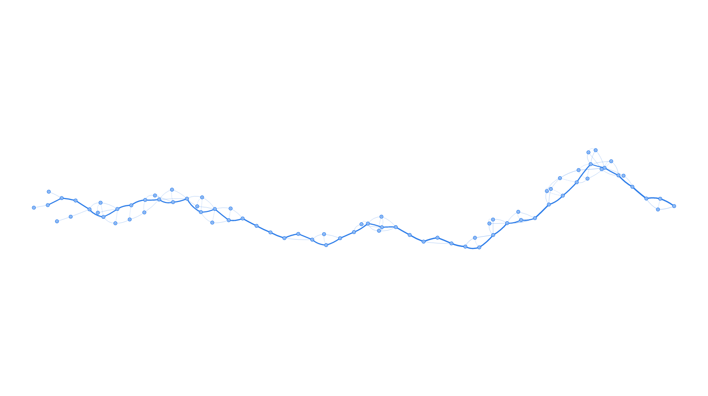

# A Simple Partial Order Alignment implementation


This is a simple python implementation of a Partial Order Alignment for MSA,
based on

[Multiple sequence alignment using partial order graphs](http://bioinformatics.oxfordjournals.org/content/18/3/452.short) (2002) by Lee, Grasso, and Sharlow 
 and
[Generating consensus sequences from partial order ...](http://bioinformatics.oxfordjournals.org/content/19/8/999.short) (2003) by Lee

for education/demonstration purposes. A short description of the method can be found on [this article](http://simpsonlab.github.io/2015/05/01/understanding-poa/) on the SimpsonLab group blog.

Some examples are provided; they are run as

```
$ ./poa.py examples/example4.fa --html ex4.html
seq1            -------------------------------TGTACNTG-TTTGTG-AGG-CTA
seq2            ---AGTTCCTGCTGCG--TTTGCTGGACTGATGTACTTG-TTTGTG-AGG-CAA
seq3            ---AGTTCCTGCTGCG--TTTGCTGGACTTATGTACTTG-TTTGTG-AGG-CAA
seq4            --AAGTTCCTGCTGCG--TTTGCTGGACTGATGTACTTGGTTTGTGNAGG-CAA
seq5            ---AGTTCCTGCTGCG--TTTGCTGGACTGATGTACTTG-TTTGT-NAGG-CAA
seq6            ---AGTTCCTGCTGCG--TTTGCT------------------------------
seq7            ---AGTTCCTGCTGCG--TTTGCTGGACTGATGTACTTG-TTT-----------
seq8            ---AGTTCCTGCTGCG--TTTGCTGGACTGATGTACTTG-TTTGTG-AGG-CAA
seq9            ---AGTTNCTGNTGNG--TTTGCTGGACTGATGTACTTG-TTTGTG-AGG-CAA
seq10           --------------------------------GTACNTG-TTTGTG-AGG-CTA
seq11           ---AGTTCCTGCTGCG--TTTGCTGGACTGATGTACTTG-TTTGTG-AGG-CAA
seq12           ---AGTTCCTGCTGCG--TTTGCTGGACTGATGTACTTG-TTTGTG-AGG-CAA
seq13           ---AGTTCCTGCTGCG--TTTGCTGGACTGATGTACTTG-TTTGTG-AGG-CAA
seq14           ---AGTTCCTGCTGCT--TTTGCTGGACTGATGTACTTG-ATTGTG-AGG-CAA
seq15           ---AGTTCCTGCTGCG--TTTGCTGGACTGATGTACTTG-TTTGTG-AGG-CAA
seq16           ---AGTTCCTGCTGCG--CTTGCTGGACTGATGTACTTG-TTTGTG-AGG-CAA
seq17           ---AGTTCCTGCTGCG--TTTGCTGGACTGATGTACTTG-TTTGTG-CGG-CAA
seq18           ---AGT-CCTGC-GCG--TTTGC-GGACGGATGTACTTG--TTGTG-AGG-CAA
seq19           -------------------------------------------------G-CAA
seq20           ------------------------------------------------GG-CAA
seq21           ---------------------------CTGATGTACTTG--TTGTG-AGGGCAA
seq22           ---AGTTCCTGCTGCG--TTTGCTGGACTGATGTACTTG-TTTGTG-AGG-CAA
seq23           -G----TTCTGCCTGC-GTTTGCTGAACTGATGTACTTG-TTAGT--AAG-CAA
seq24           C---GTTACTGC-GGGG-TTTGCTGGACTCATG-ACTTTGTTNGTA-G-G-CAA
Consensus0      --AAGTTCCTGCTGCG--TTTGCTGGACTGATGTACTTG-TTTGTG-AGG-CAA
```

which produces an HTML file ex4.html, which uses [viz.js](http://visjs.org/)
to give an interactive output of small alignments; the output from above looks
like:



**NOTE**: This version has been modified from the earlier version to remove
affine gap penalties (which I hadn't originally been doing correctly!).
The correct affine gap calculation introduces enough complication to somewhat
obscure the important part of this example code, which is the graph-string
alignment, so what remains is a simple linear gap model.
